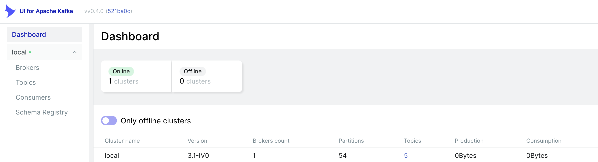
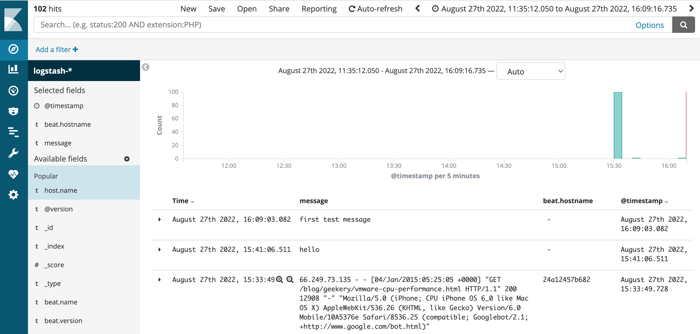

# Log Aggregation Pipeline

## Overview

<p float="left">
    
</p>

## Demo

1. Create a shared network between `kafka` and `elk`:
```bash
$ docker network create kafka-elk-shared-network
```

2. Start all the `kafka` services:
```bash
$ cd kafka
$ docker-compose up
```

3. Go to http://localhost:8080/ to check the `kafka` cluster status w.r.t. `brokers`, `topics`, `consumers`, and `schema registry`:
<p float="left">
    
</p>

4. Start all the `elk` services:
```bash
$ cd elk
$ docker-compose up
```

5. Go to http://localhost:5601/ to configure `index patterns` for `logstash-*` with `@timestamp`, and then logs can be explored in `discover`:
<p float="left">
    
</p>

6. To explore more about `producer`, `consumer`, and `zookeeper` in the host console:
```bash
$ kafka-console-producer.sh --topic filebeat --bootstrap-server localhost:29092
$ kafka-console-consumer.sh --topic filebeat --bootstrap-server localhost:29092 --from-beginning

$ zookeeper-shell.sh localhost:2181
ls /brokers/ids
```

## References

* https://github.com/tintinrevient/micro-service-sharing/tree/master/log-aggregation
* https://github.com/tintinrevient/Kafka
* https://www.elastic.co/guide/en/logstash/current/advanced-pipeline.html
* https://www.elastic.co/guide/en/logstash/current/use-filebeat-modules-kafka.html
* https://github.com/provectus/kafka-ui
* https://github.com/provectus/kafka-ui/blob/master/documentation/compose/kafka-ui.yaml
* https://github.com/confluentinc/kafka-tutorials/
* https://github.com/confluentinc/kafka-tutorials/blob/master/_includes/tutorials/aggregating-sum/ksql/code/docker-compose.yml
* https://stackoverflow.com/questions/35832095/difference-between-links-and-depends-on-in-docker-compose-yml
* https://stackoverflow.com/questions/40146921/how-to-list-all-available-kafka-brokers-in-a-cluster
* https://stackoverflow.com/questions/34393779/connect-two-instances-of-docker-compose
* https://github.com/sermilrod/kafka-elk-docker-compose
* https://github.com/eunsour/docker-elk
